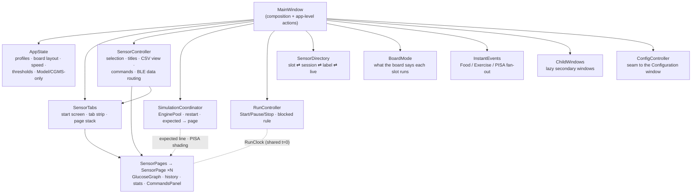

# Application Architecture

The desktop app (`src/`, PyQt6) is organized into layers reflecting the
`api → services → core → models → gui` (+ `utils`) directory split — see
[`ARCHITECTURE.md`](ARCHITECTURE.md) for how this fits into the whole
system.

```
src/
├── main.py         entry point
├── api/            BLE wire-format contract (no I/O, no Qt)
├── services/       active BLE I/O — connections, scanning, pairing
├── core/           shared cross-cutting state (the message log)
├── models/          physiological simulation + profile persistence (no Qt widgets)
├── gui/         every window/dialog — the UI layer
└── utils/          reserved for generic helpers (currently empty)
```

The dependency direction is one-way: `gui/` depends on everything below
it; `services/` depends on `api/`; `models/` and `api/` depend on nothing
else in the project. Nothing in `api/`, `services/`, `core/`, or `models/`
imports from `gui/` — the backend has no idea the UI exists, which is
what makes `models/` reusable standalone (`cgmsim/` is the CLI-only sibling
of the same model math) and lets Model Only mode run the full simulation
with zero BLE/UI code in the hot path.

## 1. Threading model

Everything that can block — a BLE operation, or a real-time simulation tick
— runs on its own `QThread`, never the GUI thread, communicating back via
Qt's signal/slot mechanism (which is thread-safe by construction: a signal
emitted from a worker thread and connected to a slot living on the GUI
thread is automatically delivered as a **queued** call, executed the next
time the GUI thread's event loop is free — no manual locking needed on the
receiving end).

| Thread | Class | File | Talks to GUI via |
|---|---|---|---|
| One per connected device | `BleSession` | `services/ble_session.py` | `new_message`, `config_read`, `write_failed`, `reset_sync` signals |
| One while scanning | `BluetoothScanThread` | `services/bluetooth_scanner.py` | device-found signal |
| One per active run | `SimulationEngine` | `models/engine.py` | `expected_reading` signal |

`BleSession` additionally owns **its own asyncio event loop** inside its
`run()` — `bleak` (the BLE library) is asyncio-native, so bridging it into
Qt means: the GUI thread calls thread-safe entry points
(`queue_write()`, `request_read()`), which use
`loop.call_soon_threadsafe()` / `asyncio.run_coroutine_threadsafe()` to hand
work to that session's asyncio loop; results come back out via the signals
above. Every connected device gets its own `BleSession`/asyncio loop —
`bluetooth_window.py`'s `sessions()` dict is the registry.

The GUI thread also owns two small `QTimer`s: `RunController`'s 500 ms re-check
of whether any sensor link is live (it polls each session's plain `is_live`
flag, so it never touches bleak across threads), and `SensorTabs`' shared blink
timer, which runs only while some tab is blinking.

`SimulationEngine` (see [`MODELS.md`](MODELS.md) §7 for what it computes)
is a plain polling loop (`k_sleep`-equivalent: `self.msleep(...)`), one tick
per wall-clock second, independent of any BLE activity — it's the Python-side
twin of the firmware's `model_thread`, and deliberately has *no* dependency
on whether a board is even connected.

## 2. Backend layers

### 2.1 `api/` — the BLE contract

- **`ble_uuids.py`** — every custom 128-bit characteristic UUID, as plain
  string constants. Must byte-for-byte match `config_service.c`'s
  `BT_UUID_128_ENCODE(...)` calls — there is no shared source of truth
  beyond both sides being hand-kept in sync (see
  [`PROTOCOL_SPEC.md`](../PROTOCOL_SPEC.md)).
- **`protocol.py`** — `encode_*`/`decode_*` functions: Python `struct.pack`/
  `unpack` calls producing the exact little-endian byte layouts the
  firmware's C structs expect (`__packed`, no compiler padding). Each
  `encode_*` has a matching firmware-side parse and, where the
  characteristic is readable, a `decode_*` that's an exact inverse — this
  is verified by the Users window's "+ Read from…" round-trip (and on hardware by
  `scripts/hw_user_read.py`).

Neither file imports Qt or does any I/O — they're pure data transformation,
which is why `models/` (the physiological math) can safely import from
`api/` (`protocol.py` needs `ModelId`/parameter name lists from `models/`)
without creating a dependency on the GUI or BLE stack.

### 2.2 `services/` — active BLE I/O

- **`ble_session.py`** — `BleSession`, the persistent per-device connection
  (see §1). Also home to `_sfloat_to_float()` (decoding the standard CGMS
  Measurement's IEEE-11073 SFLOAT glucose value) and the custom
  config-service characteristic discovery/dispatch table
  (`CONFIG_CHAR_KEY_BY_UUID`, incl. `"sensor_select"`).
  **Multi-sensor:** a numbered advertised name ("Nordic Glucose Sensor 3")
  sets `_own_instance_index` / `slot_index` (0-based) so the session shows only
  that slot's CGM Measurement + Food/Exercise Status, and `_require_pairing =
  False` so it skips the Windows pairing step (Option-A firmware needs none, and
  attempting it wedges the WinRT stack). An optional `display_name` (the
  assigned patient — see `board_layout`) is what `_user_id()` shows on the tree
  / graph, without disturbing any name parsing. `request_read()` rides the same
  FIFO as `queue_write()`, so "set the sensor-select cursor, then read that
  slot" stays ordered. `send_board_layout(slots)` runs the whole multi-slot push
  as one coroutine (cursor + per-slot config + optional per-slot CSV upload,
  paced and retried).
  **Link lifecycle:** the session registers bleak's `disconnected_callback`, so
  a board that powers off or leaves range ends the session loop (`is_live`
  false, `disconnected` emitted) instead of idling on a dead client; a drop
  *during* setup raises `connect_failed` rather than the confusing "connected,
  could not subscribe". `link_silent` reports a subscription that delivers
  nothing (see `silence_watchdog.py`).
- **`silence_watchdog.py`** — `SilenceWatchdog`, a pure clock-driven state
  machine fed by CGM Measurement notifications: after four missed intervals it
  asks for a re-arm of the subscription, after three failed re-arms it reports
  the link silent, and it never fires while the board is deliberately stopped.
- **`bluetooth_scanner.py`** — `BluetoothScanThread`, a short-lived BLE
  discovery scan (via `bleak.BleakScanner`), feeding `bluetooth_window.py`'s
  device list. A device with no name is reported as `UNKNOWN_DEVICE_NAME`, which
  the window never lets overwrite a name it already learned.
- **`windows_ble_pairing.py`** — Windows-only, `winrt`-based programmatic
  pairing (typing the fixed test passkey automatically instead of needing
  the OS's own pairing prompt); local-imported from `ble_session.py` only
  when actually pairing, so the `winrt` dependency isn't required on other
  platforms.

### 2.3 `core/` — shared state

- **`ble_message_log.py`** — `BleMessageLog`, a single `QObject` with one
  `new_message` signal, instantiated once by `MainWindow` and passed to
  every window that needs BLE traffic: `sensor_controller.py` (tabs/graphs),
  `debug_window.py`/`message_detail_window.py` (raw inspection). This is
  the app's internal pub/sub bus — `BleSession` instances feed it, an
  arbitrary number of windows subscribe to it, and none of those windows
  need to know about each other or about `BleSession` directly.

### 2.4 `models/` — physiological simulation (see [`MODELS.md`](MODELS.md))

- `types.py` — the plain-data contract (`PersonProfile`, `SensorProfile`,
  `FoodEvent`, `ExerciseEvent`, `ModelId`, `SensorId`) shared by everything
  above it.
- `{cambridge,uva_padova,royparker,deichmann}.py`, `sensors.py` — the model
  math itself, ported verbatim from `cgmsim/src/cgmsim_*.c`.
- `engine.py` — `SimulationEngine` (§1) and `EnginePool`, one engine per
  occupied board slot sharing one clock and speed (pause / resume / stop and
  one-shot events fan out).
- `profile_store.py` — JSON persistence of every saved `PersonProfile`/
  `SensorProfile` to `data/profiles.json` (`dataclasses.asdict` + `json`,
  no external serialization library).
- `board_layout.py` — the slot → (person, sensor) map for a multi-sensor
  board (`BoardLayout` / `SlotAssignment`), persisted to
  `data/board_layout.json`; applied by `BleSession.send_board_layout()`.
- `alerts.py` — `alert_for(glucose, thresholds)` → normal / warning / critical
  plus direction. The single definition shared by the graph's line colour and
  the sensor tabs' warning icon and blink, so they cannot disagree.
- `app_settings.py` — same style, for app-wide settings in
  `data/settings.json` (glucose range thresholds, speed multiplier, rolling
  view window, theme).
- `food_log_csv.py` — reader for D1NAMO-style food-log CSVs, auto-paired to
  a Dexcom export by file id (`Dexcom_001` ↔ `Food_Log_001`).
- `cgm_metrics.py` — pure `compute()` of the clinical range metrics
  (TIR/TBR1/TBR2/TAR1/TAR2, mean, population variance, SD, CV) for a list
  of glucose values; shared by the CSV Analysis window and the main
  window's live metrics panel. TIR/TBR/TAR are reported as **time in each
  band** (`*_min` fields, rendered `h:mm` by `fmt_hm`): pass `span_minutes`
  (the CSV window's real duration, or the live view's wall-clock span). The
  `*_pct` fractions are kept underneath.
- `dexcom_csv.py` — pure stdlib reader for Dexcom Clarity CGM exports
  (`dataset/Dexcom_*.csv`), returning the EGV `(timestamp, glucose)` rows.

## 3. UI layer (`gui/`)

### 3.1 Vocabulary

| Term | Meaning |
|---|---|
| **Sensor** | One simulated CGM on the board — a BLE identity, a CGMS service instance and a config. The board runs 3. |
| **User** | A simulated person as the app edits and sends it: name, picture, weight (the model's `BW`), a source (glucose model + sensor noise + food/exercise, or a recorded CSV window). Replaces the Person + Sensor profile pair (ADR 0006); edited on the profile screen opened from the **Users** button. |
| **Slot** | A sensor's 0-based index on the board. A numbered advertised name (`"Nordic Glucose Sensor 3"`) is slot 2. A single-sensor board has no slot (`None`). |
| **Session** | One `BleSession` — the live connection to one BLE identity. Its `user_id` is the label every message it emits carries. |
| **Tab** | One sensor in the browser-style strip: avatar, name, alert icon (no number — the tooltip has the value). |
| **Page** | Everything for one sensor: its own graphs, history, stats and Commands panel. One page per tab, plus one default page (Model Only / "nothing selected"). |
| **Run** | One Start → Stop of the simulation. All pages share its timeline (the run clock). |
| **Board mode** | What the *board* says a slot runs — "CSV replay" or a model's name — as opposed to what the app last tried to send. |

### 3.2 How the window is put together

`MainWindow` is composition plus the few actions that cut across the rest
(speed, Model Only / CGMS Only, profile changes). Everything else lives in the
piece that owns it:



Dependencies point one way. The pieces talk through constructor-supplied
callbacks and Qt signals rather than reaching into `MainWindow`, which is why
each one can be tested on its own (`tests/test_run_controller.py`,
`test_sensor_tabs.py`, `test_sensor_pages.py`, …).

| Module | Owns |
|---|---|
| `main_window.py` | Builds and wires the pieces; the actions that touch several of them: speed, Model Only / CGMS Only, profile / person / sensor changes |
| `app_state.py` — `AppState` | Person/sensor profiles, `board_layout` (slot → patient/sensor record), active person/sensor, speed multiplier, graph view window, range thresholds, the `model_only` / `cgms_only` flags; `engine_slots()` (which person runs on which slot) and persistence to `data/` |
| `run_clock.py` — `RunClock` | The run's t=0 and speed multiplier; converts a timestamp to simulated seconds. Every graph reads it, so Start re-anchors all of them at once |
| `start_push.py` — `StartPush` | Start's first step: writes the app's per-sensor profiles (person, sensor, schedules) to the board before the run begins |
| `run_controller.py` — `RunController` | The run state machine (stopped / starting / running / paused), the toolbar Start/Pause/Resume and Stop buttons, the run-state broadcast to the boards and its "reached N of M sensors" report; decides when the buttons and the Commands panels are blocked |
| `simulation.py` — `SimulationCoordinator` | The `EnginePool`, the single restart point every profile/mode/layout change goes through, and where each slot's expected line and PISA shading land |
| `sensor_directory.py` — `SensorDirectory` | Read-only answers about the connected sessions: a slot's session id, a session's slot, whether it is live, its visible label |
| `sensor_tabs.py` — `SensorTabs` | The "Connect Bluetooth" start screen, the tab strip (avatar, name, alert icon, close button, and a "+" to connect another sensor), the page stack, tab alerts and the shared blink timer |
| `sensor_pages.py` / `sensor_page.py` | The page stack and one sensor's page (see §3.4) |
| `sensor_controller.py` — `SensorController` | Which page is showing, each page's title / CSV view, wiring each page's Commands panel to its sensor, recording BLE messages onto the right page, tab events (connect, close, select) |
| `commands_panel.py` — `CommandsPanel`, `command_dialogs.py` | The Food… / Exercise… / PISA… buttons of one sensor, each opening a small modal form for that event's numbers |
| `instant_events.py` — `InstantEvents` | Fans a one-shot event out to the local engine, the board, and the target page's shading; returns the outcome text |
| `board_mode.py` — `BoardMode` | Reads each slot's Data Source / model name back from the board, for titles and the CSV view (§3.6) |
| `board_link.py` — `BoardLink` | "For every live session, write …" and per-slot sends, with reach counts |
| `child_windows.py` — `ChildWindows` | Lazily creates, shows and closes the secondary windows; the Bluetooth window is special because sessions live in it |
| `toolbar.py` | Builds the toolbar: Start/Stop on the left, the window buttons (Configuration, Debug) on the right — there is no Connect Bluetooth button; connecting is the start screen's button and the tab strip's "+" |
| `config_controller.py` — `ConfigController` | The typed signal seam between `MainWindow` and the Configuration window |
| `glucose_graph.py` — `GlucoseGraph` | The two matplotlib canvases of one page and every draw decision (range bands, trace coloured exactly at the limits, optional sample dots, PISA shading, rolling window) |
| `range_stats.py` — `RangeStatsPanel` | The TIR/TBR/TAR grid under a page's graphs |
| `avatar.py` | Generated initials disc used on tabs (profile avatars are not implemented yet) |
| `theme.py`, `widgets.py` | Light/dark/system palette; shared spin boxes and label helpers |

### 3.3 Secondary windows

Opened from the toolbar or from the Configuration window; created on first use
by `ChildWindows` and kept, so re-opening raises the same instance.

| Window | Role |
|---|---|
| `configuration_window.py` — `ConfigurationWindow` | The Speed choice (exactly two: 1 second per second = real time, or 1 minute per second = x60 — a multiplier set elsewhere, e.g. by a scenario, shows as a read-only entry), Model-Only and CGMS-Only toggles, the **Appearance** group (UI theme and the rolling graph time window — formerly the separate View window) and the editable glucose range thresholds. People are not edited here any more: see the Users window |
| `users_window.py` — `UsersWindow` | The **Users** button's window: the list, **+ Read from…** (a sensor's slot turned into a user — unknown name → unsaved draft, same name and content → open it, same name different content → Overwrite / Create `Name#2`, which also renames the board's user), **+ New**, Open, Delete. `user_reader.py` does the read; `models/user_board.py` decides the outcome |
| `user_profile_window.py` — `UserProfileWindow` | One window per user (`user_profiles.py`): picture, name and a menu (Profile, CSV, Food, Exercise, Model) on the left, the page on the right, **Preview** / **Save** / **Send to…** at the bottom. Edits a *copy* and writes it to the list only on Save (closing asks Save / Discard / Cancel); the mode (model or CSV) enables the pages it uses. Pages: `user_profile_page.py`, `user_model_page.py`, `user_schedule_pages.py` (Food and Exercise, one class), `user_csv_page.py` |
| `user_preview_window.py` | The 24 h preview of the user on screen — the noise-free stepper over its meals, exercise and model, or the recorded CSV window |
| `user_sender.py` — `UserSender` | **Send to…**: one push through the chosen sensor's session, refused up front for a user the board cannot take, a dead link or a sensor that does not list `user_name` |
| `csv_analysis_window.py` — `CsvAnalysisWindow` | Load a Dexcom export, slide a 24 h window, read range metrics for the whole recording and the selection; also the picker behind the profile screen's CSV page ("Use this 24 h window") |
| `bluetooth_window.py` — `BluetoothWindow` | Device list, scan, multi-device connect / disconnect; owns the `sessions()` dict; emits `session_connected` (opens that sensor's tab) and offers `disconnect_device()` (the tab's close button) |
| `device_target.py` | `restart_board()` / `await_send_confirmation()` |
| `debug_window.py` / `message_detail_window.py` | Live list of every BLE message; field dump of one |

There is no Board Layout window and no Faults window any more: the slot →
user record is written when **Send to…** lands a user on a sensor, and PISA
is one of the Commands panel's three commands. `BleSession.send_board_layout()`
remains as a programmatic whole-board push used by `scripts/e2e_4sensor.py`.

### 3.4 Sensor tabs and pages

The central area is a `SensorTabs`:

- **Nothing connected → start screen.** A centered "Connect a sensor to begin"
  with a **Connect Bluetooth** button. Model Only has no board, so it shows the
  pages without a tab strip.
- **Browser-style look.** The strip is a band a little darker than the page; the
  selected tab is drawn in the page colour with rounded top corners (so it reads as
  part of the page), the other tabs sit flat on the band with thin dividers and a
  slight lift on hover. It is painted from the live palette, so light and dark themes
  both work.
- **A "+" after the last tab** (as in a browser) opens the Bluetooth window to connect
  another sensor; it is the only way in once tabs exist, since the toolbar has no
  Connect Bluetooth button.
- **A sensor connects → its tab appears** (`BluetoothWindow.session_connected`),
  with no alert until the first reading. A sensor that reconnects after a power
  cycle keeps its tab and history, matched by slot (or by address on a
  single-sensor board), even if its session id changed meanwhile.
- **A sensor drops → its tab greys out** ("offline", alert cleared)
  with its graph intact; it revives on reconnect.
- **The tab's close button disconnects that sensor and discards its page**
  (no confirmation).

Each tab owns an independent **page**: its own `GlucoseGraph` (glucose +
food/exercise canvases), its own history buffers, `RangeStatsPanel` and
`CommandsPanel`. A BLE message or an expected-model tick for sensor B is
appended to B's page and nowhere else; switching tabs only brings another page
forward, so nothing is rebound, copied or lost. All pages share one `RunClock`
timeline. The cost is one set of matplotlib canvases per sensor; a page that is
not on screen records data but defers its redraw until it is shown.

**Alerts** use `models/alerts.py` (the same function colours the graph line):

| Level | Condition (default thresholds) | Tab |
|---|---|---|
| normal | 70 – 180 mg/dL | no icon |
| warning | 54 – 70 or 180 – 250 | amber ⚠ |
| critical | < 54 or > 250 | red ⚠; the tab **blinks red until opened**, then stays solid red until the reading leaves the critical range |

A critical tab that is already the open one goes straight to solid. Recovering
and going critical again blinks afresh. A going-offline tab clears its alert (a
stale reading must not alarm). Changing the thresholds re-evaluates every tab at
once. One shared timer drives all blinking and runs only while some tab is
blinking. The tab shows no number; the tooltip gives the value and direction
("262 mg/dL — critically high").

**The graph.** The received trace is drawn in the same range colours (green in
range, yellow borderline, red low/high — deliberately light), and it changes
colour **exactly where it crosses a limit**: a segment between two samples is cut
at the threshold crossing by linear interpolation, so the colour does not wait for
the next sample. A **Show points** checkbox under the statistics draws each
received sample as a dot (off by default; one app-wide choice, remembered in
`data/settings.json`, that every page follows). The glucose graph takes every
spare pixel (its margins are in inches, so the legend keeps its room however tall
it is stretched), the statistics and the command buttons sit in a compact strip
below, and when the food/exercise graph is hidden (a CSV sensor) the glucose
graph carries its own "Time (s)" axis label and drops the "Expected (model)"
legend entry (no model runs behind a replayed recording).

### 3.5 Run controls and the Commands panel

**Start / Pause / Resume and Stop live in the toolbar** (`RunController`). They
are **blocked until there is something to run**: at least one sensor with a live
link, or Model Only (which has no board). A run already in progress keeps them
usable so it can always be paused or stopped, even if every sensor has dropped;
CGMS Only locks them.

**Each page has a Commands panel** — three buttons under the statistics, **Food…**,
**Exercise…** and **PISA…**. Each opens a small modal form for that event's numbers
(Food: carbs and spread; Exercise: duration and intensity; PISA: duration and peak
attenuation) and, once accepted, sends it; a one-line result sits beside the
buttons. A command goes to *that page's sensor* — never to whatever
tab happens to be selected — and PISA shading is drawn on that page's graph. The
panel is disabled, with the reason shown, until the run is going **and** that
sensor's own link is live ("Start a run…", "No live sensor…", "This sensor is
offline…", "paused", "locked in CGMS-only mode"). It is hidden altogether for a
sensor the board reports as CSV replay: food and exercise are report-only there
and nothing the panel sends would mean anything.

### 3.6 The board is the authority

The app's profile only records what it *tried* to send; a CSV uploaded in an
earlier session, a change made from elsewhere, or a send that silently failed
all leave it disagreeing with what the board runs — and the board is what
produces the trace. So every per-sensor display decision asks `BoardMode`, which
reads each slot's **Data Source** and **Person Config** characteristics back
(attributing each answer to the session that sent it, never to "whatever tab is
selected"):

- the graph title names "CSV replay" or the model, and says "waiting for the
  board to confirm…" instead of guessing;
- the food/exercise graph and the Commands panel are hidden for a CSV sensor;
- expected-model ticks for a CSV slot are dropped, and an expected line already
  drawn is discarded the moment the board reveals CSV (there is no model behind
  that trace);
- the slot → patient rename waits for the board's acknowledgement;
- reads are serialized, one slot at a time, because the Sensor-select cursor is a
  single value on the board.

The local "expected" model is **not** built from these reads. **Start writes the
app's profile for every model-backed sensor to the board** — person model and
parameters, sensor profile, meal and exercise schedules (`start_push.py`) — and the
expected model is built from that same list (`AppState.board_plan()`), so the two
start from identical inputs. A sensor that replays a CSV is ignored by Start and
gets no expected line; so does a sensor with no patient assigned. See
[ADR 0005](adr/0005-start-pushes-the-app-profile.md).

Model Only and the empty page have no board to ask, so there the saved profile is
read directly.

**A sensor's Food/Exercise Status feeds only that sensor's own model.** While a
board runs, each sensor's reported carbs and exercise are handed to its own local
engine so the expected line follows the sensor's actual meal input. The status is
routed by the sensor it came from (`SimulationCoordinator.feed_board_food_exercise`):
with sensor 1 modelled and sensors 2 and 3 merely connected, their statuses are
dropped, not fed to sensor 1's engine (which used to make sensor 1's expected line
climb on meals only the other sensors had).

**A write the board refuses is reported.** Every write goes through the session's
queue; when the board rejects one (an Insert Food, a config write) the status bar
says "⚠ The board refused '<characteristic>' (<error>)" instead of leaving the
Commands panel's "sent" as the last word.

**Opening is not sending.** Opening a user, or saving it, only changes what is being edited: with a
board connected it does not reset the graphs (nothing changed on the board). What resets a run is
what changes it — Start, a Send to…, a speed change, toggling Model Only (which runs the user last
opened locally, so there a change does restart).

### 3.7 BLE link health, as the app sees it

- **A dropped link ends the session.** `BleSession` registers bleak's
  `disconnected_callback`; when the board powers off or goes out of range the
  session loop ends, `is_live` turns false, `disconnected` fires (the tab greys
  out) and the session leaves the Bluetooth window's list. Before this a dead
  link idled forever, still "Connected".
- **Silent subscriptions are noticed.** `services/silence_watchdog.py` watches
  CGM Measurement notifications only (the board's other characteristics kept
  notifying while a sensor was silent). After four missed intervals it re-arms
  the subscription on the same connection; after three failed re-arms it emits
  `link_silent`, shown as **"No data"** in the Bluetooth window. A stopped board
  is not silent.
- **Reconnects do not cross wires.** Closing a session and opening a new one for
  the same address (Disconnect then Connect, or an automatic reconnect) can
  deliver the old thread's `finished` / `disconnected` after the new session is
  already registered; both handlers ignore a session that has been replaced.
  The advertised name is kept across a failed attempt and across a rescan that
  returned "Unknown device", so a retry opens under `"Nordic Glucose Sensor N"`
  (which picks the slot) and never under the bare MAC.
- **Subscribe retries.** `start_notify` is retried (4 attempts, ~0.9 s apart)
  with the CGM Measurement first, because a congested 3rd/4th link times out.

## 4. Data flow examples

**User edits and sends a user:**
`user_profile_window.py` (edits a copy of the `User`) → Save (`user_store.save()`, `data/users.json`
plus the user's folder) → Send to… (choose a sensor; Save and send / Send without saving if there
are unsaved edits) → `user_sender.UserSender` → `models.user_send.slot_entry()` (the ordered writes) →
`BleSession.send_board_layout()` (cursor, name, model + sensor + both schedules cleared and
rewritten — or the CSV upload and then the CSV source) → the board applies and saves each write →
`board_layout_finished` → `MainWindow._on_user_sent()` → `record_slot_assignment()` records which
user now sits on which slot, persists it, relabels the tabs / Bluetooth list, restarts the local
engines, and re-asks the board what that slot runs.

**A sensor connects:**
`BleSession` finishes subscribing → `BluetoothWindow._on_connected()` →
`session_connected(address, session)` → `SensorController.on_session_connected()`
→ `SensorTabs.ensure_tab()` (or revives the tab of the same slot/address) → the
tab appears with "—"; the first tab is selected, which brings its page forward.

**A CGM reading arrives:**
firmware notify → `BleSession`'s notification handler (asyncio callback) →
(multi-sensor: dropped unless it's this identity's own CGMS instance) →
decodes the standard CGMS SFLOAT payload → emits on `core.BleMessageLog`'s
`new_message` signal (queued onto the GUI thread) →
`SensorController.on_new_message()`: `SensorTabs.note_message()` updates the
tab's value and alert (`models.alerts`), and — while a run is going — the
reading is appended to **that sensor's page** (`SensorPage.add_received()`),
which redraws only if it is the page on screen.

**A run starts:** the toolbar Start → `RunController.start()` (button reads
"Starting…", both buttons blocked) → `StartPush` writes the app's profile for every
live, non-CSV sensor to the board (speed, person, sensor, data source, meal and
exercise schedules, one slot after another through one session) → once the board has
taken them all, `SimulationCoordinator.restart()` (stop the pool, `RunClock`
re-anchored to now, every page cleared, one engine rebuilt per slot from the same
profiles) → engines resumed → `RUN_STATE_STOPPED` then `RUN_STATE_RUNNING` to every
connected board, with a status-bar report of how many sensors it reached. If the push
fails the run does not start (status bar says why). Model Only and a board with only
CSV sensors skip the push. The local engines and every board's `model_thread`
begin ticking from the same nominal t=0, independently (see
[`ARCHITECTURE.md`](ARCHITECTURE.md) §5 for why they're not kept in lockstep
beyond that shared starting point). Each engine tick lands on its slot's page as
the dashed "expected" line.

**A command is sent from a tab:** the Commands panel emits the numbers →
`InstantEvents.inject_food/exercise/fault` for that page's slot → the local
engine gets the one-shot event, the board gets the one-shot write (no reset) →
the outcome text ("✓ … sent to N sensor(s)" / "⚠ … NOT sent — no live board
link") appears on that page's panel and in the status bar; a PISA interval is
shaded on that page's graph.

**A tab is closed:** close button → `SensorController.on_tab_close_requested()`
→ `BluetoothWindow.disconnect_device(address)` → the session stops → the tab and
its page are removed; with no tabs left the start screen returns.

**A multi-sensor layout is pushed programmatically:**
`scripts/e2e_4sensor.py` builds each slot's writes and calls
`BleSession.send_board_layout(slots)`, which runs one coroutine: per slot,
write `sensor_select` then the per-slot writes (paced ~80 ms, retried on a full
config queue) then any CSV upload, finally `run_state = RUNNING` →
`board_layout_progress` / `board_layout_finished` signals. See
[`ARCHITECTURE.md`](ARCHITECTURE.md) §4.5.
