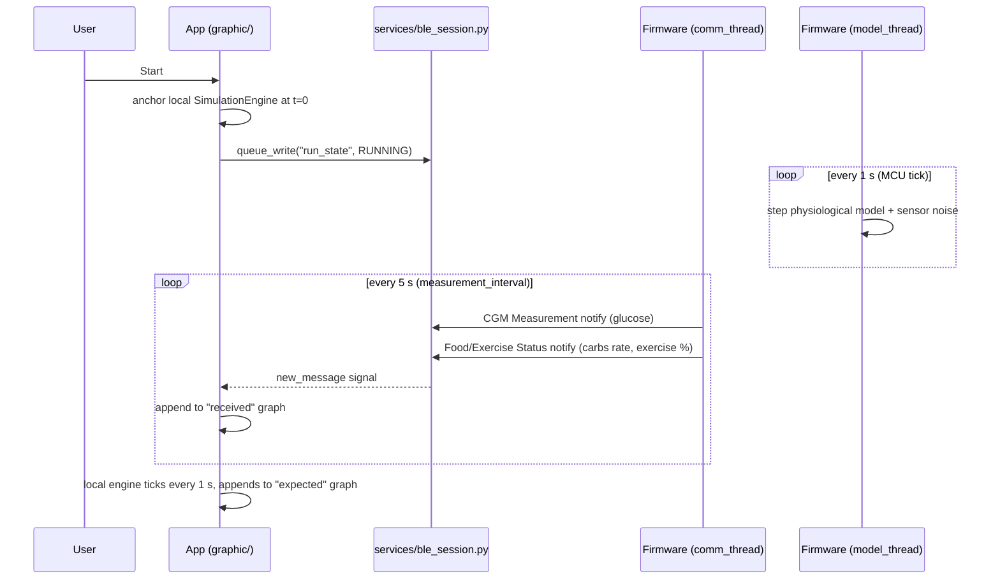
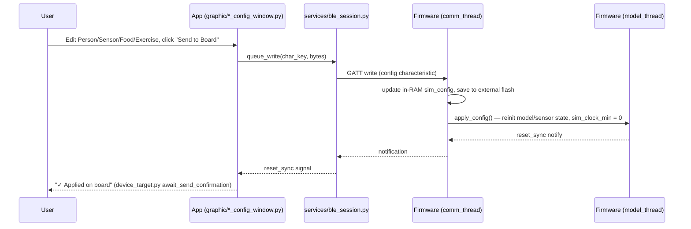
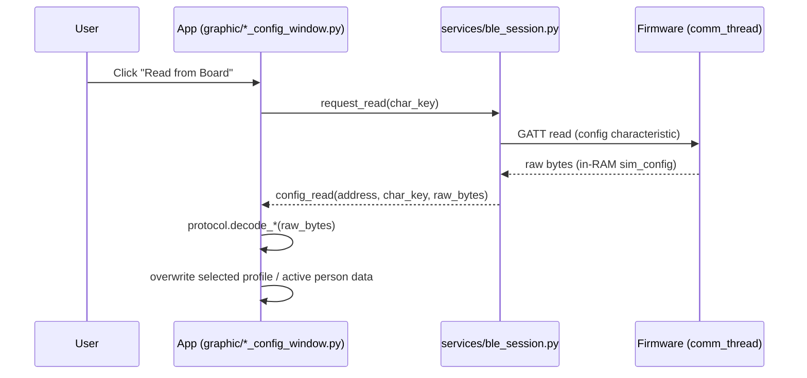
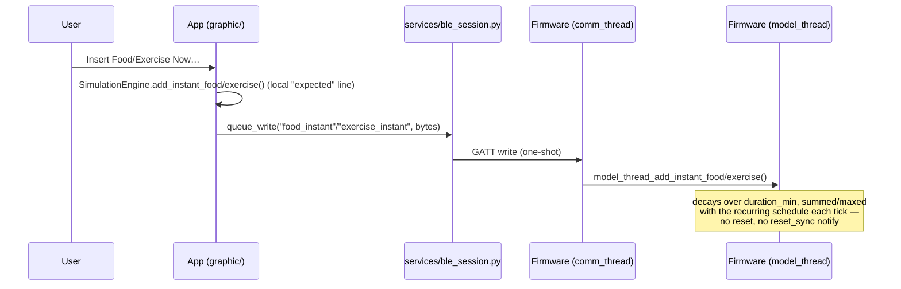
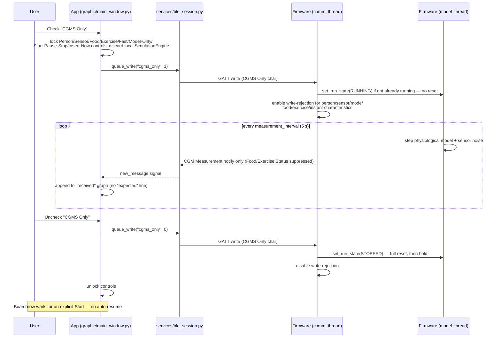

# System Architecture

This is the top-level map of SensorSimulator: what the two halves of the
system are, how they talk to each other, and where to look for detail.
For byte-level wire format, see [`PROTOCOL_SPEC.md`](../PROTOCOL_SPEC.md).
For firmware internals, see [`FIRMWARE.md`](FIRMWARE.md). For the app's
internals, see [`APPLICATION.md`](APPLICATION.md). For the physiological
models and sensor noise math, see [`MODELS.md`](MODELS.md).

## 1. What this project is

A TCC (Brazilian undergraduate thesis) project simulating a Continuous
Glucose Monitoring (CGM) sensor: an nRF54L15 development kit runs firmware
that behaves like a real CGM sensor over Bluetooth Low Energy — advertising,
pairing, and streaming glucose readings exactly as a real device would — but
the "patient" behind those readings is a physiological model (one of four),
optionally fed simulated meals and exercise, run entirely on the MCU. A
desktop app connects to the board, configures that simulated patient,
displays the incoming readings, and — as a correctness check — runs the
*same* model in parallel on the PC with no sensor noise, so the two curves
("received" vs. "expected") can be compared live.

## 2. The two halves

```
┌─────────────────────────────────────┐         ┌──────────────────────────────────────────┐
│         PC — SensorSimulator app      │   BLE   │        nRF54L15 DK — peripheral_cgms       │
│              (Python / PyQt6)         │◄───────►│           (C / Zephyr RTOS)                 │
│                                        │         │                                              │
│  graphic/  — windows & dialogs (UI)   │         │  comm_thread   — BLE, config, flash         │
│  services/ — BLE session/scan/pairing │         │  model_thread  — physiological model,       │
│  api/      — BLE wire-format contract │         │                  sensor noise, 1 s tick      │
│  core/     — shared message log       │         │  external SPI-NOR — sim_config persistence  │
│  models/   — same physiological math, │         │                                              │
│              run locally for "expected"│         │                                              │
└─────────────────────────────────────┘         └──────────────────────────────────────────┘
```

Both sides run **the same model math** (see [`MODELS.md`](MODELS.md)) —
the Python `models/` package and the firmware's `src/models/cgmsim_*.c`
files are, by design, numerically identical ports of the same source
(`cgmsim/src/cgmsim_*.c`, the project's original standalone CLI simulator).
This is what makes the "expected vs. received" comparison meaningful: any
divergence between the two lines is either sensor noise (intentional) or a
bug (not).

## 3. Why a real board instead of just simulating in Python

The assignment requires an embedded, RTOS-based (Zephyr) implementation
using real BLE hardware — the board isn't a convenience, it's the point.
Concretely, the firmware must independently prove:
- a **two-thread RTOS design** (model vs. communication — see
  [`FIRMWARE.md`](FIRMWARE.md) §1),
- **non-volatile storage** on external flash, surviving reboots,
- a real **Bluetooth GATT server** implementing the standard CGM Service
  plus a custom configuration service, working against an unmodified BLE
  client stack (Windows' own, via `bleak`).

The app is a client of that firmware, not a replacement for it — with the
board unplugged the app can still run "Model Only" mode (§ below), but that
is a debugging/demo convenience, not the deliverable.

## 4. Data exchange, end to end

Everything that crosses the BLE link falls into one of three categories:

| Category | Direction | Characteristic(s) | Detail |
|---|---|---|---|
| **Standard CGM readings** | board → app | Bluetooth SIG CGMS: CGM Measurement (notify), Feature/Status/Session (read), RACP/SOCP (control) | [`FIRMWARE.md`](FIRMWARE.md) §4 |
| **Simulator configuration** | app ↔ board | Custom "sim config" service: person/sensor/mode/food/exercise/run-state/instant-events | [`PROTOCOL_SPEC.md`](../PROTOCOL_SPEC.md) §2 |
| **Confirmation/sync** | board → app | Reset Sync (notify) | [`PROTOCOL_SPEC.md`](../PROTOCOL_SPEC.md) §2 |

### 4.1 Development flow (Start → streaming)

This is the normal "just run it" flow — board and app are already
configured (defaults or a previous send), and the user just wants to watch
the two curves. It's the one to reach for while developing/demoing the
model math end to end:



### 4.2 Send configuration flow

Every config window's "Send to Board" button (Person, Sensor, Food,
Exercise) drives this — the write always triggers a full reset on the
board side (`apply_config_locked()`), which is how the app knows the write
landed:



### 4.3 Read configuration flow

Every config window's "Read from Board" button drives this — a plain
GATT read/response, no notify, no reset (see [`PROTOCOL_SPEC.md`](../PROTOCOL_SPEC.md)
§3):



### 4.4 Instant food/exercise events

One more write deliberately skips the reset flow in §4.2: "Insert Food
Now…"/"Insert Exercise Now…" (`graphic/instant_event_dialog.py`) injects a
one-shot event into an already-running simulation without resetting
`sim_clock_min` or model state, so there's no `reset_sync` round-trip for
it:



A *subsequent* reset from any other write (including **Stop**) does clear
these events along with everything else `apply_config_locked()` resets —
see `PROTOCOL_SPEC.md`'s "Instant food/exercise events" section for the
byte format, decay/delivery rules, and a bug this reset used to have.

**CGMS Only mode** (§7 below) is the other exception — enabling it never
resets either.

## 5. Two independent clocks, deliberately

The board's `sim_clock_min` (in `model_thread.c`) and the app's
`SimulationEngine`'s own internal simulated-minutes counter (in
`models/engine.py`) are **two separate simulations of the same math**, not
one clock shared over BLE — there's no "tell me your current glucose"
round-trip in the hot path. Each side runs its own copy of the model
independently, ticking on its own local timer, and only synchronizes at two
discrete moments: when a config write resets both to t=0 (see
`PROTOCOL_SPEC.md`'s "Run state"/"Reset sync" sections), and never again
until the next reset. This is why sensor noise (present only on the board,
via the selected `SensorProfile`) is the only thing that should visibly
separate the "expected" (noiseless, local) and "received" (noisy, from the
board) lines on the graph — everything else about the two runs is the same
deterministic ODE integration from the same starting state.

## 6. Model Only mode

With `Model Only` checked (`main_window.py`), the app never opens a BLE
connection at all — the `SimulationEngine` becomes the sole data source, its
`expected_reading` signal driving both graphs directly instead of being
compared against board data. Existing for two reasons: (1) demoing/
developing the model math without hardware nearby, and (2) isolating "is
this a model bug" from "is this a BLE/firmware bug" when something looks
wrong — if Model Only also looks wrong, the bug is in `models/`, not in the
board.

## 7. CGMS Only mode

The opposite of Model Only: with `CGMS Only` checked, the board becomes a
**pure standard-CGM data source**. It streams nothing but CGM Measurement
notifications, suppresses Food/Exercise Status notifications, and refuses
every write to person/sensor/mode/food-event/exercise-event/food-instant/
exercise-instant — only Run state and the CGMS Only characteristic itself
stay writable. Existing to let the app (or any unmodified BLE CGM client)
exercise the standard CGM Service in isolation from the custom sim-config
service, as its own correctness check independent of the simulator UI.

Enabling never resets (whatever's running keeps running); disabling always
performs the same full reset a Run-state `STOPPED` write does, and — unlike
the board's normal "autonomous, defaults to running" behavior — requires an
explicit Start afterward rather than auto-resuming. See `PROTOCOL_SPEC.md`'s
"CGMS Only mode" section for the full write-rejection and transition rules.



## 8. Where each concern actually lives

| Concern | Owner |
|---|---|
| Physiological model math (ODEs) | `models/cgmsim_*.c` (firmware) and `models/*.py` (app) — same source, two ports |
| Sensor noise math | firmware only (`models/cgmsim_sensors.c`) — never modeled in the app; the app's "expected" line is deliberately noiseless |
| BLE wire format | `api/ble_uuids.py` + `api/protocol.py` (app) and `config_service.c` + `sim_config.h` (firmware) — both sides hand-kept in sync, see [`PROTOCOL_SPEC.md`](../PROTOCOL_SPEC.md) |
| Config persistence | firmware only — `sim_config.c`, external SPI-NOR flash |
| Profile persistence | app only — `models/profile_store.py`, `data/profiles.json` |
| UI | `graphic/` (app only — firmware has no display beyond one status LED) |
