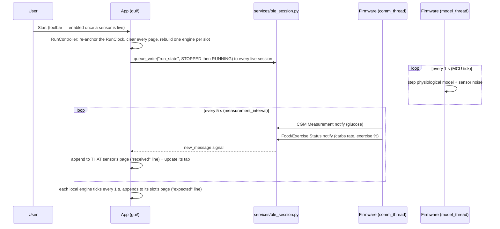
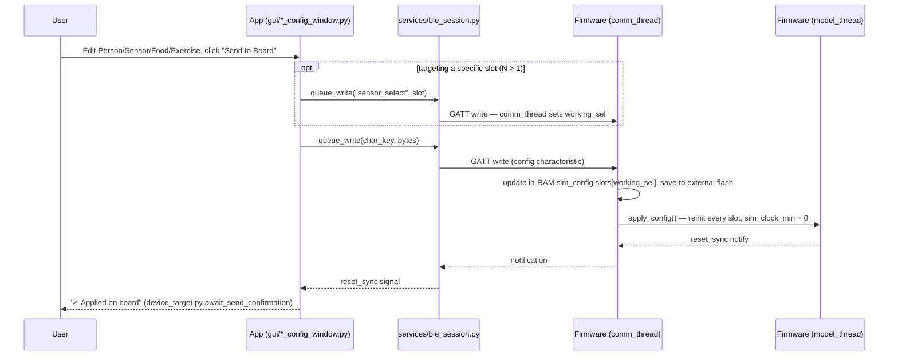
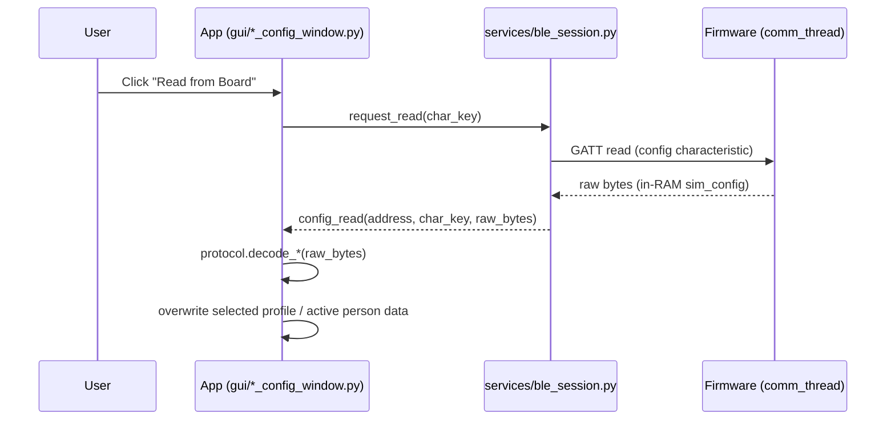
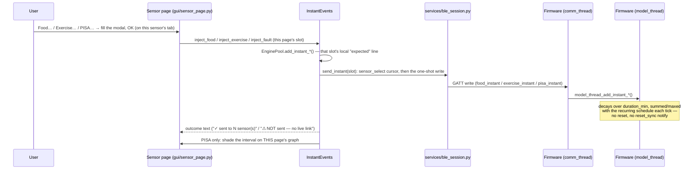
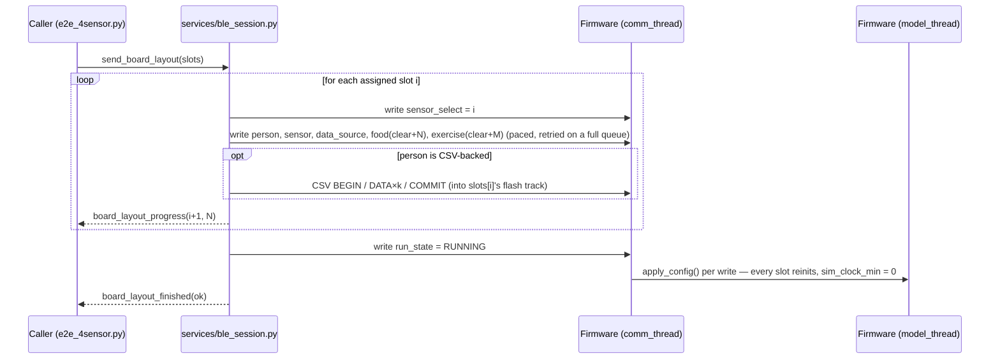
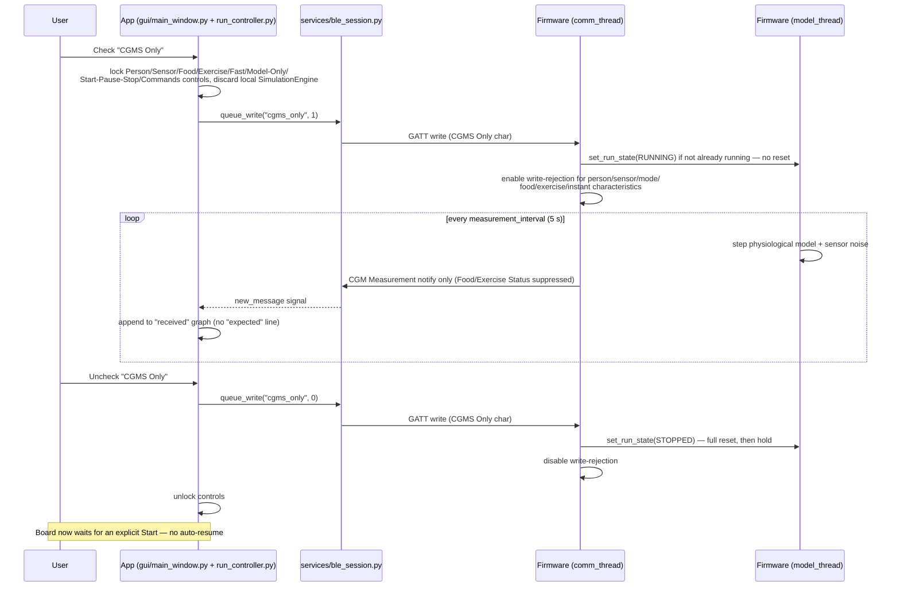

# System Architecture

This is the top-level map of SensorSimulator: what the two halves of the
system are, how they talk to each other, and where to look for detail.
For byte-level wire format, see [`PROTOCOL_SPEC.md`](../PROTOCOL_SPEC.md).
For firmware internals, see [`FIRMWARE.md`](FIRMWARE.md). For the app's
internals, see [`APPLICATION.md`](APPLICATION.md). For the physiological
models and sensor noise math, see [`MODELS.md`](MODELS.md). For a
thesis-ready LaTeX write-up of the flows below (§4) plus the Dexcom
profile, the PISA fault model, and the multi-sensor architecture with the
Windows pairing limitation, see [`architecture_flows.tex`](architecture_flows.tex).

## 1. What this project is

A TCC (Brazilian undergraduate thesis) project simulating a Continuous
Glucose Monitoring (CGM) sensor: an nRF54L15 development kit runs firmware
that behaves like a real CGM sensor over Bluetooth Low Energy — advertising,
pairing, and streaming glucose readings exactly as a real device would — but
the "patient" behind those readings is a physiological model (one of four),
optionally fed simulated meals and exercise, run entirely on the MCU. A
desktop app connects to the board, configures that simulated patient,
displays the incoming readings, and — as a correctness check — runs the
*same* model in parallel on the PC with no sensor noise, so the two curves
("received" vs. "expected") can be compared live.

## 2. The two halves

```
┌─────────────────────────────────────┐         ┌──────────────────────────────────────────┐
│         PC — SensorSimulator app      │   BLE   │        nRF54L15 DK — peripheral_cgms       │
│              (Python / PyQt6)         │◄═══════►│           (C / Zephyr RTOS)                 │
│                                        │  N BLE  │                                              │
│  gui/  — sensor tabs + pages, windows │identity │  main.c        — N BLE identities + adv     │
│  services/ — BLE session/scan/pairing │  links  │                  sets + CGMS instances       │
│  api/      — BLE wire-format contract │         │  comm_thread   — BLE push (per slot),       │
│  core/     — shared message log       │         │                  config queue, flash        │
│  models/   — same physiological math, │         │  model_thread  — N independent slots,       │
│              run locally for "expected"│         │                  1 shared clock, 1 s tick    │
│  board_layout — slot → patient record │         │  external SPI-NOR — sim_config (v5) + CSV   │
└─────────────────────────────────────┘         └──────────────────────────────────────────┘
```

The firmware runs **`CONFIG_APP_SENSOR_COUNT` (1–3; the shipped build is 3)
fully independent sensor slots** on the one board — each its own BLE identity,
advertising set, CGMS service instance, and config (physiological model +
params + noise + schedule, *or* a CSV, mixable). `N == 1` is the original
single-sensor build and behaves exactly as the diagrams below describe with
"the board" = slot 0. For `N > 1` see [§9](#9-multi-sensor-n-independent-slots).

Both sides run **the same model math** (see [`MODELS.md`](MODELS.md)) —
the Python `models/` package and the firmware's `src/models/cgmsim_*.c`
files are, by design, numerically identical ports of the same source
(`cgmsim/src/cgmsim_*.c`, the project's original standalone CLI simulator).
This is what makes the "expected vs. received" comparison meaningful: any
divergence between the two lines is either sensor noise (intentional) or a
bug (not).

## 3. Why a real board instead of just simulating in Python

The assignment requires an embedded, RTOS-based (Zephyr) implementation
using real BLE hardware — the board isn't a convenience, it's the point.
Concretely, the firmware must independently prove:
- a **two-thread RTOS design** (model vs. communication — see
  [`FIRMWARE.md`](FIRMWARE.md) §1),
- **non-volatile storage** on external flash, surviving reboots,
- a real **Bluetooth GATT server** implementing the standard CGM Service
  plus a custom configuration service, working against an unmodified BLE
  client stack (Windows' own, via `bleak`).

The app is a client of that firmware, not a replacement for it — with the
board unplugged the app can still run "Model Only" mode (§ below), but that
is a debugging/demo convenience, not the deliverable.

## 4. Data exchange, end to end

Everything that crosses the BLE link falls into one of three categories:

| Category | Direction | Characteristic(s) | Detail |
|---|---|---|---|
| **Standard CGM readings** | board → app | Bluetooth SIG CGMS: CGM Measurement (notify), Feature/Status/Session (read), RACP/SOCP (control) — **one instance per sensor slot** | [`FIRMWARE.md`](FIRMWARE.md) §4 |
| **Simulator configuration** | app ↔ board | Custom "sim config" service (**one instance, shared**): person/sensor/data-source/food/exercise/run-state/speed/comm-profile/instant-events | [`PROTOCOL_SPEC.md`](../PROTOCOL_SPEC.md) §2 |
| **Slot targeting** | app → board | **Sensor select** (`5b2c0015`) — a session cursor: subsequent per-sensor reads/writes hit `slots[selected]` | [`PROTOCOL_SPEC.md`](../PROTOCOL_SPEC.md) §2 |
| **Per-slot ground truth** | board → app | Food/Exercise Status (notify) — 10 B, leading `u8 slot`; one per active slot per tick | [`PROTOCOL_SPEC.md`](../PROTOCOL_SPEC.md) §2 |
| **Confirmation/sync** | board → app | Reset Sync (notify) — global (any slot's config apply) | [`PROTOCOL_SPEC.md`](../PROTOCOL_SPEC.md) §2 |

### 4.1 Development flow (Start → streaming)

This is the normal "just run it" flow — board and app are already
configured (defaults or a previous send), and the user just wants to watch
the two curves. It's the one to reach for while developing/demoing the
model math end to end:


```mermaid
sequenceDiagram
    participant U as User
    participant App as App (gui/)
    participant BLE as services/ble_session.py
    participant FW as Firmware (comm_thread)
    participant Model as Firmware (model_thread)

    U->>App: Start (toolbar — enabled once a sensor is live)
    App->>App: RunController: re-anchor the RunClock, clear every page, rebuild one engine per slot
    App->>BLE: queue_write("run_state", STOPPED then RUNNING) to every live session
    loop every 1 s (MCU tick)
        Model->>Model: step physiological model + sensor noise
    end
    loop every 5 s (measurement_interval)
        FW->>BLE: CGM Measurement notify (glucose)
        FW->>BLE: Food/Exercise Status notify (carbs rate, exercise %)
        BLE-->>App: new_message signal
        App->>App: append to THAT sensor's page ("received" line) + update its tab
    end
    App->>App: each local engine ticks every 1 s, appends to its slot's page ("expected" line)
```

Start/Pause/Resume/Stop are toolbar buttons owned by `RunController`
(`gui/run_controller.py`). They stay **blocked until at least one sensor link is
live** (Model Only, which has no board, is the exception), so a click can never
silently go nowhere; the broadcast reports how many sensors it reached.

### 4.2 Send configuration flow

Every config window's "Send to Board" button (Person, Sensor, Food,
Exercise) drives this — the write always triggers a full reset on the
board side (`apply_config_locked()`), which is how the app knows the write
landed. On a multi-sensor board the write targets whichever slot the
**Sensor select** cursor points at (default slot 0):


```mermaid
sequenceDiagram
    participant U as User
    participant App as App (gui/*_config_window.py)
    participant BLE as services/ble_session.py
    participant FW as Firmware (comm_thread)
    participant Model as Firmware (model_thread)

    U->>App: Edit Person/Sensor/Food/Exercise, click "Send to Board"
    opt targeting a specific slot (N > 1)
        App->>BLE: queue_write("sensor_select", slot)
        BLE->>FW: GATT write — comm_thread sets working_sel
    end
    App->>BLE: queue_write(char_key, bytes)
    BLE->>FW: GATT write (config characteristic)
    FW->>FW: update in-RAM sim_config.slots[working_sel], save to external flash
    FW->>Model: apply_config() — reinit every slot, sim_clock_min = 0
    Model-->>FW: reset_sync notify
    FW-->>BLE: notification
    BLE-->>App: reset_sync signal
    App-->>U: "✓ Applied on board" (device_target.py await_send_confirmation)
```

> **Note.** A **Speed** write (`5b2c0012`) currently goes through this same
> `apply_config_locked()` path (it resets the clock and clears instant
> events). See `FEATURE_IDEAS.md` #21 — making speed a live scalar is a
> pending fix; `e2e_4sensor.py` works around it by waiting for `reset_sync`
> before firing an instant event after a speed change.

### 4.3 Read configuration flow

Every config window's "Read from Board" button drives this — a plain
GATT read/response, no notify, no reset (see [`PROTOCOL_SPEC.md`](../PROTOCOL_SPEC.md)
§3):


```mermaid
sequenceDiagram
    participant U as User
    participant App as App (gui/*_config_window.py)
    participant BLE as services/ble_session.py
    participant FW as Firmware (comm_thread)

    U->>App: Click "Read from Board"
    App->>BLE: request_read(char_key)
    BLE->>FW: GATT read (config characteristic)
    FW-->>BLE: raw bytes (in-RAM sim_config)
    BLE-->>App: config_read(address, char_key, raw_bytes)
    App->>App: protocol.decode_*(raw_bytes)
    App->>App: overwrite selected profile / active person data
```

### 4.4 Instant food / exercise / PISA events

One more write deliberately skips the reset flow in §4.2: the one-shot
**Food**, **Exercise** and **PISA** commands. They are sent from the
**Commands panel on a sensor's own tab** (`gui/commands_panel.py`) and inject an
event into an already-running simulation without resetting `sim_clock_min` or
model state, so there is no `reset_sync` round-trip for it:


```mermaid
sequenceDiagram
    participant U as User
    participant Tab as Sensor page (gui/sensor_page.py)
    participant Ev as InstantEvents
    participant BLE as services/ble_session.py
    participant FW as Firmware (comm_thread)
    participant Model as Firmware (model_thread)

    U->>Tab: Food… / Exercise… / PISA… → fill the modal, OK (on this sensor's tab)
    Tab->>Ev: inject_food / inject_exercise / inject_fault (this page's slot)
    Ev->>Ev: EnginePool.add_instant_*() — that slot's local "expected" line
    Ev->>BLE: send_instant(slot): sensor_select cursor, then the one-shot write
    BLE->>FW: GATT write (food_instant / exercise_instant / pisa_instant)
    FW->>Model: model_thread_add_instant_*()
    Note over Model: decays over duration_min, summed/maxed<br/>with the recurring schedule each tick —<br/>no reset, no reset_sync notify
    Ev-->>Tab: outcome text ("✓ sent to N sensor(s)" / "⚠ NOT sent — no live link")
    Ev->>Tab: PISA only: shade the interval on THIS page's graph
```

A command goes to **the sensor whose tab it was pressed on** — there is no
target picker and no "which row is selected?" lookup, so it cannot reach another
sensor by accident. The panel is disabled, with the reason shown, until the run
is going and that sensor's own link is live, and it is hidden for a sensor the
board reports as CSV replay.

A *subsequent* reset from any other write (including **Stop**) does clear
these events along with everything else `apply_config_locked()` resets —
see `PROTOCOL_SPEC.md`'s "Instant food/exercise events" section for the
byte format, decay/delivery rules, and a bug this reset used to have.

On a multi-sensor board the app writes the **Sensor select** cursor first
(to the page's slot), then the one-shot event.

**CGMS Only mode** (§7 below) is the other exception — enabling it never
resets either.

### 4.5 Slot assignment and the whole-board push (multi-sensor)

There is no Board Layout window any more. A patient reaches a slot through the
ordinary **Send to Board** of Person Configuration (which also sends the
patient's data source, uploading a CSV when the patient replays one), targeted
at a slot with the **Sensor select** cursor. Each send reports which slot got
which patient, and `MainWindow.record_slot_assignment()` keeps the slot → patient
record (`data/board_layout.json`, `models/board_layout.py`) true: it relabels
tabs and the Bluetooth list, rebuilds the engine pool, and re-asks the board what
the slot now runs (§11.2).

`BleSession.send_board_layout()` remains as the programmatic push — one
coroutine over **one** connection (any identity reaches the shared config
service), paced so the firmware's config queue keeps up — and is what
`scripts/e2e_4sensor.py` drives:


```mermaid
sequenceDiagram
    participant H as Caller (e2e_4sensor.py)
    participant BLE as services/ble_session.py
    participant FW as Firmware (comm_thread)
    participant Model as Firmware (model_thread)

    H->>BLE: send_board_layout(slots)
    loop for each assigned slot i
        BLE->>FW: write sensor_select = i
        BLE->>FW: write person, sensor, data_source, food(clear+N), exercise(clear+M)  (paced, retried on a full queue)
        opt person is CSV-backed
            BLE->>FW: CSV BEGIN / DATA×k / COMMIT  (into slots[i]'s flash track)
        end
        BLE-->>H: board_layout_progress(i+1, N)
    end
    BLE->>FW: write run_state = RUNNING
    FW->>Model: apply_config() per write — every slot reinits, sim_clock_min = 0
    BLE-->>H: board_layout_finished(ok)
```

Verified end to end by `scripts/e2e_4sensor.py` (see
[`E2E_TEST_PLAN.md`](E2E_TEST_PLAN.md) §9).

## 5. Two independent clocks, deliberately

The board's `sim_clock_min` (in `model_thread.c`) and the app's
`SimulationEngine`'s own internal simulated-minutes counter (in
`models/engine.py`) are **two separate simulations of the same math**, not
one clock shared over BLE — there's no "tell me your current glucose"
round-trip in the hot path. On a multi-sensor board there is still exactly
**one** `sim_clock_min` and one speed multiplier — all N slots tick from it
together (see §9); the app's local engine runs for the one selected patient. Each side runs its own copy of the model
independently, ticking on its own local timer, and only synchronizes at two
discrete moments: when a config write resets both to t=0 (see
`PROTOCOL_SPEC.md`'s "Run state"/"Reset sync" sections), and never again
until the next reset. (App-side, the *plot* timeline is a separate, shared
thing: one `RunClock` — the run's t=0 and the speed multiplier — that every
sensor page reads, so Start re-anchors all of them at once; see §11.) This is why sensor noise (present only on the board,
via the selected `SensorProfile`) is the only thing that should visibly
separate the "expected" (noiseless, local) and "received" (noisy, from the
board) lines on the graph — everything else about the two runs is the same
deterministic ODE integration from the same starting state.

## 6. Model Only mode

With `Model Only` checked (`main_window.py`), the app never opens a BLE
connection at all — the `SimulationEngine` becomes the sole data source, its
`expected_reading` signal driving both graphs directly instead of being
compared against board data. It is shown as one synthetic **"Model — <person>"
page** in the same layout, without the sensor tab strip, and its Start/Stop and
Commands stay enabled (they need no board). Existing for two reasons: (1) demoing/
developing the model math without hardware nearby, and (2) isolating "is
this a model bug" from "is this a BLE/firmware bug" when something looks
wrong — if Model Only also looks wrong, the bug is in `models/`, not in the
board.

## 7. CGMS Only mode

The opposite of Model Only: with `CGMS Only` checked, the board becomes a
**pure standard-CGM data source**. It streams nothing but CGM Measurement
notifications, suppresses Food/Exercise Status notifications, and refuses
every write to person/sensor/mode/food-event/exercise-event/food-instant/
exercise-instant — only Run state and the CGMS Only characteristic itself
stay writable. Existing to let the app (or any unmodified BLE CGM client)
exercise the standard CGM Service in isolation from the custom sim-config
service, as its own correctness check independent of the simulator UI.

Enabling never resets (whatever's running keeps running); disabling always
performs the same full reset a Run-state `STOPPED` write does, and — unlike
the board's normal "autonomous, defaults to running" behavior — requires an
explicit Start afterward rather than auto-resuming. See `PROTOCOL_SPEC.md`'s
"CGMS Only mode" section for the full write-rejection and transition rules.


```mermaid
sequenceDiagram
    participant U as User
    participant App as App (gui/main_window.py + run_controller.py)
    participant BLE as services/ble_session.py
    participant FW as Firmware (comm_thread)
    participant Model as Firmware (model_thread)

    U->>App: Check "CGMS Only"
    App->>App: lock Person/Sensor/Food/Exercise/Fast/Model-Only/<br/>Start-Pause-Stop/Commands controls, discard local SimulationEngine
    App->>BLE: queue_write("cgms_only", 1)
    BLE->>FW: GATT write (CGMS Only char)
    FW->>Model: set_run_state(RUNNING) if not already running — no reset
    FW->>FW: enable write-rejection for person/sensor/mode/<br/>food/exercise/instant characteristics
    loop every measurement_interval (5 s)
        Model->>Model: step physiological model + sensor noise
        FW->>BLE: CGM Measurement notify only (Food/Exercise Status suppressed)
        BLE-->>App: new_message signal
        App->>App: append to "received" graph (no "expected" line)
    end

    U->>App: Uncheck "CGMS Only"
    App->>BLE: queue_write("cgms_only", 0)
    BLE->>FW: GATT write (CGMS Only char)
    FW->>Model: set_run_state(STOPPED) — full reset, then hold
    FW->>FW: disable write-rejection
    App->>App: unlock controls
    Note over U,App: Board now waits for an explicit Start — no auto-resume
```

## 8. Where each concern actually lives

| Concern | Owner |
|---|---|
| Physiological model math (ODEs) | `models/cgmsim_*.c` (firmware) and `models/*.py` (app) — same source, two ports |
| Sensor noise math | firmware only (`models/cgmsim_sensors.c`) — never modeled in the app; the app's "expected" line is deliberately noiseless |
| BLE wire format | `api/ble_uuids.py` + `api/protocol.py` (app) and `config_service.c` + `sim_config.h` (firmware) — both sides hand-kept in sync, see [`PROTOCOL_SPEC.md`](../PROTOCOL_SPEC.md) |
| Config persistence (board) | firmware only — `sim_config.c` (v5, per-slot), external SPI-NOR flash; uploaded CSV tracks in `csv_store.c` (per slot) |
| Sensor count | build-time only — `CONFIG_APP_SENSOR_COUNT`; `sim_config_load_from_flash()` force-overrides the flash value so it always matches the running build |
| Profile persistence (app) | `models/profile_store.py` → `data/profiles.json`; slot→patient map in `models/board_layout.py` → `data/board_layout.json` |
| Per-identity demux | `services/ble_session.py` — parses the advertised name's trailing digit to a 0-based `_own_instance_index`, filters CGM Measurement + Food/Exercise Status to that slot, and sets `_require_pairing = False` for numbered identities |
| UI | `gui/` (app only — firmware has no display beyond one status LED); composition in [`APPLICATION.md`](APPLICATION.md) §3 |
| Per-sensor display state (history, graphs, stats, commands) | one `gui/sensor_page.py` `SensorPage` per sensor — nothing is shared between sensors except the `RunClock` timeline |
| What a slot is *really* running | the board — `gui/board_mode.py` reads it back; the app's profile is only a guess (§11.2) |
| Where a reading sits against the thresholds | `models/alerts.py`, used by both the graph colouring and the tab alerts |
| Link health | `services/ble_session.py` (drop detection, subscribe retries) + `services/silence_watchdog.py` (silent subscription); firmware side in §10 |

## 9. Multi-sensor: N independent slots

`CONFIG_APP_SENSOR_COUNT` (1–3, default 3) sets how many fully independent
sensor slots the one board runs. Each slot has its own `struct sensor_slot`
in `sim_config` v6 — data source (model + params + noise + food/exercise
schedule) **or** an uploaded CSV, mixable (e.g. 2 CSV + 1 model). What is
**shared**: `sim_clock_min`, `speed_mult`, and the run state (one Start/Stop
for all — per-slot run state is `FEATURE_IDEAS.md` #19).

```
                          nRF54L15 DK (CONFIG_APP_SENSOR_COUNT = 3)
  ┌───────────────────────────────────────────────────────────────────────┐
  │  main.c:  identity 0..2  ─ adv set 0..2 ─ bt_cgms instance g_cgms[0..2]│
  │           "Nordic Glucose Sensor 1".."3"   (identity 0 = factory addr) │
  │                                                                        │
  │  model_thread:   rt[0]   rt[1]   rt[2]             ← per-slot model +   │
  │                    │       │       │                 noise + schedule   │
  │                    └───────┼───────┘                                    │
  │                            │                                            │
  │                    sim_clock_min  (one, shared)  ── speed_mult          │
  │                            │                                            │
  │  comm_thread:  push loop over slots → bt_cgms_measurement_add(g_cgms[i])│
  │                + one Food/Exercise Status notify per slot (u8 slot)     │
  │                config queue: per-sensor writes → sim_config.slots[sel]  │
  │  config_service:  ONE sim-config service; "Sensor select" (5b2c0015)   │
  │                   picks `sel` for per-sensor reads/writes              │
  └───────────────────────────────────────────────────────────────────────┘
        ▲ BLE identity i ── one connection per identity ── app: one BleSession each
```

**App.** Connect to each identity's address (Bluetooth window) → one
`BleSession` per identity → one **tab** per identity, appearing as soon as the
session connects. Each session shows only its own slot's CGM Measurement +
Food/Exercise Status (demux by the advertised-name digit); each tab has its own
page with its own graphs and Commands panel (§11). A patient reaches a slot
through Person Configuration's Send to Board (§4.5). Once a slot is assigned,
the Bluetooth list, the tab and the config windows' "Target device" combo show
that **patient's name** instead of "Nordic Glucose Sensor N"
(`models/board_layout.device_label` / `session_name`; the advertised name still
drives the demux + pairing). The config windows also have a **"Slot"** picker
(`DeviceTargetBar`) so one slot can be reconfigured without re-pushing the
whole layout; one-shot events need no picker — they come from the tab of the
sensor they are for.

**Pairing.** Windows aborts LE Secure Connections against the board's
non-default identities (confirmed on hardware — see
[`PROTOCOL_SPEC.md`](../PROTOCOL_SPEC.md) §7 and the `ble-pairing-issue`
memory). So `N > 1` builds set `CONFIG_APP_CGMS_NO_AUTH` — the CGMS
characteristics drop the authenticated-link requirement and all N identities
stream **unpaired** (acceptable for a simulator; see the
`cgms-no-auth-tradeoff` memory). `N == 1` keeps real pairing + encryption.

**Verification.** `scripts/e2e_4sensor.py` — 11 hardware cases (plus the
long-run and soak harnesses in §10): layout push,
per-slot readback, per-identity demux, CSV slot playback, shared fast-mode
clock, slot-targeted Insert Food/Exercise/PISA, range alerts, per-slot
config isolation, reconnect autonomy, reboot persistence. See
[`E2E_TEST_PLAN.md`](E2E_TEST_PLAN.md) §9.

## 10. BLE link reliability

Running several identities at once on one board against Windows' BLE stack
surfaced a family of failures where a link looked healthy and delivered
nothing. Each has a cause, a fix, and a place it is checked:

| Symptom | Cause | Fix | Where |
|---|---|---|---|
| The 4th sensor connects, "subscribes", and never notifies | Windows (WinRT) fails to deliver same-UUID notifications when all N CGMS instances fire at the same instant | `CONFIG_APP_CGMS_STAGGER_NOTIFY` (default on for N > 1): instance k reports at k/N of the interval. Measured on hardware: silent in 0/12 runs on vs 12/12 off | firmware `Kconfig`; `scripts/ble_ab_batch.py` |
| A subscription that stays silent is invisible | `start_notify` succeeding says nothing about delivery | `SilenceWatchdog`: re-arm after 4 missed intervals, report "No data" after 3 failed re-arms | `services/silence_watchdog.py`; `scripts/watchdog_check.py` |
| Sensors go silent about an hour after boot | CGMS `session_run_time` was 1 h; at expiry the instance latched "session stopped" and never notified again until reboot | `session_run_time = 24 * 7` (a simulator has no reason to model sensor end-of-life) | firmware `main.c`; found by `scripts/ble_soak.py` |
| This PC's own adapter reconnects to identity 1 about twice a second (reason `0x13`), starving the others | stale Windows GATT device nodes tied to that identity's address | the secondary identities' address generation bumped (`SECONDARY_ID_ADDR_GEN`); stored identities that no longer match are re-addressed with `bt_id_reset()`; re-advertising backs off (1 s, doubling, cap 30 s) after a link that dies inside 2 s | firmware `main.c` |
| A board that powers off still shows "Connected" | the session loop never noticed the drop | `disconnected_callback` ends the loop; the tab greys out | `services/ble_session.py` |
| After a failed connect, a retry streams all sensors into one MAC-named row | the window forgot the advertised name when a session ended | the name is kept (and a nameless rescan never overwrites it); late signals from a replaced session are ignored | `gui/bluetooth_window.py` |

Operational notes for the bench: adding or re-addressing identities means
**rescan and reconnect** (the old addresses are gone); never run two soak/AB
batches at once (they split the board's links and corrupt both).

Long-run checks: `scripts/ble_soak.py` (host side) with
`scripts/ble_soak_serial.ps1` (board side), `scripts/e2e_long_3sensor.py`
(two-hour functional run for the three-sensor build) and
`scripts/e2e_overnight_3sensor.py` (unattended overnight orchestration). Their
logs go under `.scratch/` and are git-ignored.

## 11. App design: independent pages and the board as the authority

The pieces are described in [`APPLICATION.md`](APPLICATION.md) §3; this records
*why* they are shaped that way. Decision records are in [`adr/`](adr/).

### 11.1 One independent page per sensor (not one shared graph)

The app originally had a single graph that was re-pointed at whichever sensor's
row was selected: the plot buffers were *aliased* onto that sensor's history
lists. That forced every handler to ask "is this the selected sensor?" before
redrawing, made PISA shading bleed onto other sensors' graphs, keyed history by a
label that went stale when a slot was re-assigned, and tangled the god object
`MainWindow` (1,100+ lines). Each sensor now owns a `SensorPage` — canvases,
buffers, stats, Commands — and the only thing shared is the `RunClock`. A message
or a tick for sensor B is appended to B's page and nowhere else. The price (one
set of matplotlib canvases per sensor) is paid knowingly; hidden pages record but
defer their redraw. ([ADR 0001](adr/0001-independent-sensor-pages.md))

### 11.2 The board is the source of truth for per-sensor state

What the app last sent is a guess. `BoardMode` reads each slot's Data Source and
Person Config back from the board (when a sensor connects, one slot at a time), attributes the answer to the session that
sent it, and every display decision — graph title, CSV view, whether the Commands
panel shows — follows it, saying "waiting for
the board to confirm…" instead of guessing. Writes that go nowhere say so
(run-state reach counts, "NOT sent — no live link"). ([ADR 0002](adr/0002-board-is-the-authority.md))

The *expected model* is the exception, and it goes the other way: **Start writes the
app's profile for each live, non-CSV sensor to the board, and builds the expected model
from that same profile** (`AppState.board_plan`), so the board and the model start from
identical inputs instead of the model chasing a readback of whatever the board held.
([ADR 0005](adr/0005-start-pushes-the-app-profile.md))

### 11.3 Tabs and alerts

A browser-style tab per sensor appears on connect, greys when the link drops and
closes (disconnecting) with its close button; with nothing connected the whole
area is a "Connect Bluetooth" start screen. Out-of-range readings flag the tab:
a warning icon (no number or arrow — the tooltip has the value and direction), and for critical a red tab that blinks
until it has been opened, then stays solid until the reading recovers — so a
sensor parked at a critical value flags once for attention instead of blinking
all session. Levels come from one function (`models/alerts.py`) shared with the
graph. ([ADR 0003](adr/0003-tab-alerts.md))

### 11.4 Decomposing `MainWindow`

`MainWindow` went from ~1,180 lines to ~370, composition plus a handful of
cross-cutting actions. State moved to `AppState`; the run state machine to
`RunController`; the engine pool and restart rule to `SimulationCoordinator`;
slot/session/label lookups to `SensorDirectory`; selection, titles, commands and
data routing to `SensorController`; the tab strip and pages to `SensorTabs`;
lazy windows to `ChildWindows`. The pieces take callbacks and emit signals
instead of reaching into the window. ([ADR 0004](adr/0004-decompose-main-window.md))

## 12. Users: one profile per simulated person (in progress)

Status (2026-10-06): the model layer and the firmware's name field are done and
tested; the screens are not built yet. Plan and slice list:
[`.scratch/users-screen/spec.md`](../.scratch/users-screen/spec.md). Decision:
[ADR 0006](adr/0006-users-replace-person-and-sensor.md).

A **User** replaces the Person profile, the Sensor profile and the slot→(person,
sensor) record. It is what you create, edit, preview, save and send:

| Part | What it holds |
|---|---|
| Identity | `id` (stable, names the data folder), `name` (30 bytes — what the board is told), picture, height (app-only), weight (written into the model's `BW`) |
| Mode | `"model"` or `"csv"` — picks which of the inputs below runs; the unused inputs are kept |
| Model mode | physiological model + parameters, sensor-noise model + parameters, food and exercise schedules |
| CSV mode | the 24 h glucose window (+ Food Log) **stored inside the user**, not a path |

```
 data/users.json            fields + schedules, versioned
 data/users/<id>/csv.json   the recorded window (a user without one has no file)
 data/users/<id>/picture.*  copied in when chosen
```

**Where it lives in code** (`src/models/`, all pure — no Qt, no board):
`types.User` / `CsvTrack`; `user_store` (load, save, one-time migration from
`profiles.json` + `board_layout.json`, which are then left alone as a backup);
`user_match` (`compare` a board-read user with a saved one, float32-aware, order-free
schedules; `apply_board` to overwrite; `next_free_name` → `Ana#2`, `clip_name`);
`user_sim` (the engine profile for a user and `preview_24h`, which steps the same
noise-free `ModelStepper` as the expected line).

**Read from the board.** One slot is read under the Sensor-select cursor (name, data
source, person config, sensor config, food and exercise lists), turned into a *board
user* and looked up **by name**: unknown → a new unsaved "Unknown" user; same name and
`compare()` empty → open the saved user; same name but different → ask *Overwrite* or
*Create `Name#2`* (which also writes the new name to the board, so the two agree).
CSV is not read back yet: a board in CSV mode yields a CSV user whose track is not
available, and `compare()` ignores the track until the firmware can send it.

**On the board.** The name is the new **User name** characteristic (`5b2c0016`,
[`PROTOCOL_SPEC.md`](../PROTOCOL_SPEC.md)): per slot via Sensor select, persisted in
`sim_config` v6, and — unlike every other config write — it does **not** reset the
simulation. The advertised BLE name stays "Nordic Glucose Sensor N".

**What this changes elsewhere (as the slices land).** `AppState.board_plan` becomes
slot → user (Start still writes exactly that list and the expected-line engines are
built from it — ADR 0005 holds with "profile" meaning "user"); the Person / Sensor /
Food / Exercise windows and the Configuration window's Person/Sensor group go away; the
tab header's avatar call site takes the user's picture.
