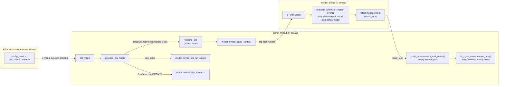

# Firmware Architecture

Board: Nordic nRF54L15 DK (`nrf54l15dk/nrf54l15/cpuapp`). SDK: nRF Connect
SDK v3.3.1 (Zephyr RTOS). Source: [`firmware/peripheral_cgms`](../firmware/peripheral_cgms)
(application) + [`firmware/overlay/nrf`](../firmware/overlay/nrf) (patched
CGMS BLE service — see §4.3). Build/flash instructions:
[`firmware/README.md`](../firmware/README.md).

See [`ARCHITECTURE.md`](ARCHITECTURE.md) for how this fits into the whole
system, and [`PROTOCOL_SPEC.md`](../PROTOCOL_SPEC.md) for the exact BLE wire
format this firmware speaks.

## 1. RTOS threads

The assignment requires demonstrating a genuine multi-threaded RTOS design
with a specific split of responsibilities: **one thread owns the
physiological simulation, a separate thread owns all communication**
(`main.c`'s comment: *"the assignment's explicit requirement"*). Concretely:

| Thread | File | Priority | Stack | Owns |
|---|---|---|---|---|
| `model_thread` | `model_thread.c` | 5 | 4096 B | Model/sensor state, the 1 Hz simulation tick, food/exercise schedule evaluation |
| `comm_thread` | `comm_thread.c` | 5 | 4096 B | BLE advertising/connection (via `main.c`), the CGMS instance, config-write draining, flash persistence |

Both are plain `k_thread_create()` threads started once at boot
(`model_thread_start()` / `comm_thread_start()` in `main.c`'s `main()`),
equal priority, cooperating via Zephyr's standard IPC primitives rather than
shared globals with ad-hoc locking:

- **`k_mutex`** protects every piece of state one thread writes and another
  reads: `model_thread.c` has `cfg_lock` (pending config handoff),
  `meas_lock` (latest measurement), `instant_lock` (one-shot event slots),
  `run_state_lock`; `comm_thread.c` has `working_cfg_lock` (the in-RAM
  config snapshot GATT reads are served from).
- **`k_msgq`** (`cfg_msgq`, depth 8) is the *only* path from a GATT write
  callback (which runs in BT host context and must return fast) into
  `comm_thread` — `config_service.c`'s write handlers just
  `comm_thread_enqueue_config()` and return immediately; the actual
  handling happens later, in `comm_thread`'s own loop.



Why this split and not, say, one thread per subsystem or a single
super-loop: `comm_thread` is where anything that can block or take
unpredictable time lives (BLE stack calls, flash erase/write cycles —
erasing a 4 KB sector is not instant). `model_thread` is the opposite: its
job is to tick at a very predictable 1 Hz regardless of what BLE traffic is
happening, so it never touches flash or the BLE stack directly — it only
exchanges small, mutex-protected snapshots with `comm_thread`. A GATT write
arriving mid-tick can't stall the simulation clock, and a slow flash erase
can't cause a tick to be skipped.

## 2. The model tick and timestep

`model_thread`'s entire loop is:

```c
while (1) {
    /* apply any pending config (cfg_lock) */
    if (state == SIM_RUN_RUNNING) {
        model_tick();
    }
    k_sleep(K_SECONDS(1));
}
```

**One tick happens per real-world second, always** — that part never
changes. What changes with `sim_config.mode` is how much *simulated* time
that one tick represents (`model_thread.c`'s `model_tick()`):

```c
double dt_min = (active_cfg.mode == SIM_MODE_FAST) ? 1.0 : (1.0 / 60.0);
```

- **Normal mode** (`SIM_MODE_NORMAL`): `dt_min = 1/60` minute = 1 simulated
  second per tick → **1 real second = 1 simulated second** (real time).
- **Fast mode** (`SIM_MODE_FAST`): `dt_min = 1.0` minute per tick → **1 real
  second = 1 simulated minute** (60× speedup) — useful for watching a
  multi-hour meal/exercise response in a couple of minutes instead of hours.

`sim_clock_min` (a free-running `double`, `model_thread.c`) accumulates
`dt_min` every tick and is the simulated-minutes-since-start clock the
food/exercise recurring schedule and the impulse-fed models' "once per
simulated day" firing logic key off of (`fmod(sim_clock_min, 1440.0)`, see
[`MODELS.md`](MODELS.md) §5).

**Why a fixed 1 Hz wall-clock tick rather than, say, a faster tick with a
smaller `dt_min`:** the CGM Measurement push cadence
(`measurement_interval`, currently 5 s) and the assignment's real-time
demo requirement both want ticks to correspond to *something a human
watching the board can perceive as roughly real time* — a much faster
internal tick would need its own throttled reporting cadence for no
numerical benefit, since the four ODE models are well-behaved at both
`dt_min` values used here (see [`MODELS.md`](MODELS.md) §7 for the
integration method itself and its stability).

## 3. Flash storage

`struct sim_config` (`sim_config.h`, ~715 B — model, sensor, mode, and both
recurring event lists) is persisted to the board's **external SPI-NOR flash**
(`mx25r64`, an 8 MB chip on the `spi00` bus), not the internal MRAM:

```
&mx25r64 {
    partitions {
        compatible = "fixed-partitions";
        sim_storage_partition: partition@0 {
            label = "sim_config_storage";
            reg = <0x00000000 0x00001000>; /* 4 KB, one erase sector */
        };
    };
};
```

This is deliberate, not incidental: the board's *internal* MRAM already
hosts a partition (`storage_partition`) used by `CONFIG_SETTINGS`/ZMS for
Bluetooth bonding data — reusing that for application config would mix two
unrelated concerns onto one partition and risk one corrupting the other.
The assignment also specifically asks for **external** flash storage, so a
second, purpose-built partition on the external chip (`sim_storage_partition`
— the more obvious name `storage_partition` was already taken) keeps the
two fully separate. `sim_config.c` talks to it directly via Zephyr's
`flash_area` API (erase + program), not through the settings/NVS subsystem —
appropriate for one fixed-size struct written wholesale on every config
change, rather than the key-value semantics `CONFIG_SETTINGS` is built for.

Load/save cycle:
- **Boot** (`main.c`): `sim_config_load_from_flash()` reads the partition;
  if `magic` (`"SIM1"`) or `version` don't match what this firmware build
  expects, it falls back to `sim_config_set_defaults()` (Cambridge model +
  Ideal CGM sensor, no scheduled events, normal mode) — so a blank/corrupt/
  incompatible flash never prevents boot, it just starts from a known state.
- **Every config write** (`comm_thread.c`'s `process_cfg_msg()`): the
  in-RAM `working_cfg` is updated, then the *entire* struct is erased and
  rewritten to flash (`sim_config_save_to_flash()`) before being handed to
  `model_thread`. Wholesale erase+rewrite (not incremental) is simple and
  fast enough at ~715 B/4 KB, and matches how infrequently config actually
  changes relative to the 1 Hz simulation tick.
- **Instant food/exercise events** (see [`PROTOCOL_SPEC.md`](../PROTOCOL_SPEC.md)'s
  "Instant food/exercise events" section) are the one exception — they
  never touch flash at all, by design, since they're meant to be transient,
  mid-run injections, not part of the saved configuration.

This means the board is **fully autonomous**: unplug it from the app, power
cycle it, and it comes back up streaming CGM data using whatever config was
last saved — the app is a remote control, not a required component.

## 4. Bluetooth stack

### 4.1 Advertising & connection

One BLE identity, one extended advertising set (`BT_LE_ADV_OPT_CONN`,
`BT_GAP_ADV_FAST_INT_MIN_2`/`MAX_2`), advertising the standard CGMS (0x181F)
and Device Information (0x180A) 16-bit service UUIDs plus the device name
("Nordic Glucose Sensor") in the scan response. `CONFIG_BT_MAX_CONN=1` — the
board serves one central at a time (the app, or any standard BLE central for
testing). On disconnect, `main.c`'s `disconnected()` callback immediately
restarts advertising, so a dropped connection is always reconnectable
without a reboot.

### 4.2 Pairing

`CONFIG_BT_SMP=y` with `CONFIG_BT_APP_PASSKEY=y`: the board uses passkey
(numeric-comparison-style) pairing rather than Just Works, but with a fixed
test passkey (`123456`, `main.c`'s `auth_app_passkey()`) instead of a
randomly generated one — deliberately, so the same value can be typed into
Windows' pairing prompt (or supplied programmatically by
`services/windows_ble_pairing.py`) every test run without watching the
board's serial console. `CONFIG_BT_SMP_LEGACY_PAIR_ONLY` is *not* forced —
the firmware accepts LE Secure Connections and only falls back to legacy
pairing if the peer can't do SC (Zephyr's default negotiation) — see
`prj.conf`'s comment for why an earlier, forced-legacy-pairing version of
this firmware was reverted (it broke encrypted GATT reads on the standard
CGMS characteristics, which require `BT_GATT_PERM_READ_AUTHEN`).

### 4.3 CGMS — the standard Continuous Glucose Monitoring Service

This is the Bluetooth SIG-standardized GATT profile real CGM sensors (Dexcom,
FreeStyle Libre, etc.) implement, so any generic CGM-compatible BLE client
can talk to this board without knowing it's a simulator. Nordic ships a
reference implementation as a Zephyr module
(`nrf/subsys/bluetooth/services/cgms`); this project vendors a **patched
copy** of it under [`firmware/overlay/nrf`](../firmware/overlay/nrf) (synced
into the live NCS checkout at build time — see
[`firmware/README.md`](../firmware/README.md)).

Characteristics (`cgms.c`'s `CGMS_ATTRS`), all requiring an authenticated
(paired+encrypted) link (`BT_GATT_PERM_*_AUTHEN`):

| Characteristic | Property | Purpose |
|---|---|---|
| CGM Measurement | notify | The glucose reading itself (SFLOAT-encoded concentration + time offset) |
| CGM Feature | read | Static capability flags (type=capillary plasma, sample location=finger) |
| CGM Status | read | Session status/calibration/warning bitfields |
| CGM Session Start Time | read/write | Wall-clock anchor for the session (client-settable) |
| CGM Session Run Time | read | How many hours the session is valid for (fixed at 1 h here) |
| Record Access Control Point (RACP) | write+indicate | Historical-record queries (report/delete/count stored records) |
| CGM Specific Ops Control Point (SOCP) | write+indicate | Runtime control — e.g. setting the communication interval |

`bt_cgms_measurement_add()` is the single entry point `comm_thread.c` uses
to publish a new reading: it appends the record to the CGMS library's own
internal record database (queryable later via RACP) *and* triggers the
periodic notify path if a client is subscribed and the session hasn't been
marked stopped.

Two deliberate patches on top of Nordic's stock implementation, both
documented inline in `cgms.c`:

1. **Communication interval in seconds, not minutes.** The Bluetooth spec
   defines `comm_interval`/SOCP's interval-set operation in whole minutes —
   too coarse for bench testing. `report_meas()`'s reschedule uses
   `K_SECONDS(cgms->comm_interval)` instead of the spec's minutes, so
   `main.c`'s `initial_comm_interval = 5` means "every 5 seconds," matching
   `measurement_interval` on the `comm_thread` side.
2. **Multiple CGMS instances — the "multi CGMS" extension.** Nordic's
   original sample assumes exactly one physical sensor = one CGMS instance.
   This project's copy replaces the single static `struct bt_cgms` with an
   array (`cgms_insts[CONFIG_BT_CGMS_INSTANCE_COUNT]`) and switches the GATT
   service definition from `BT_GATT_SERVICE_DEFINE` to
   `BT_GATT_SERVICE_INSTANCE_DEFINE(cgms_svc_list, cgms_insts,
   CONFIG_BT_CGMS_INSTANCE_COUNT, CGMS_ATTRS)` — a macro that stamps out N
   independent copies of the whole characteristic table (`bt_cgms_init()`
   claims the next free slot each call). This is what made the project's
   earlier 4-virtual-sensor-per-board design possible (`CONFIG_BT_CGMS_INSTANCE_COUNT=4`,
   one `bt_cgms_init()` call per simulated sensor); the current build trims
   it back to `=1` (see `PROTOCOL_SPEC.md` §7) but the underlying service
   code still supports more, unlike Nordic's stock single-instance version.

### 4.4 Custom configuration service

Alongside the standard CGMS, `config_service.c` registers a second,
project-specific GATT service (UUID `5b2c0001-...`) carrying everything
CGMS has no concept of: which physiological model/sensor/parameters to run,
the food/exercise schedule, run/pause/stop control, the one-shot "instant
event" injection path, and a **CGMS Only** toggle that puts the board into
a restricted mode — standard CGM Measurement notifications only, every
other write in this service rejected — without resetting whatever
simulation is already running. This is the service `api/protocol.py` and
`api/ble_uuids.py` on the app side speak. Full characteristic-by-
characteristic byte layout is authoritative in
[`PROTOCOL_SPEC.md`](../PROTOCOL_SPEC.md) §2 — not repeated here to avoid
the two documents drifting apart.

## 5. Boot sequence summary

```
main() →
  dk_leds_init()
  bt_conn_auth_cb_register()      (passkey callbacks)
  bt_enable()
  settings_load()                  (BT bonding data, internal MRAM)
  sim_config_load_from_flash()     (app config, external SPI-NOR)
  bt_cgms_init()                   (standard CGMS instance)
  bt_le_ext_adv_create() + set_data()
  config_service_init()            (custom config service — logs only,
                                     GATT registration is automatic via
                                     BT_GATT_SERVICE_DEFINE)
  comm_thread_start(cgms, cfg)     → spawns comm_thread
  model_thread_start(cfg)          → spawns model_thread
  advertising_start()
  → board is now advertising, streaming CGM data autonomously
```
